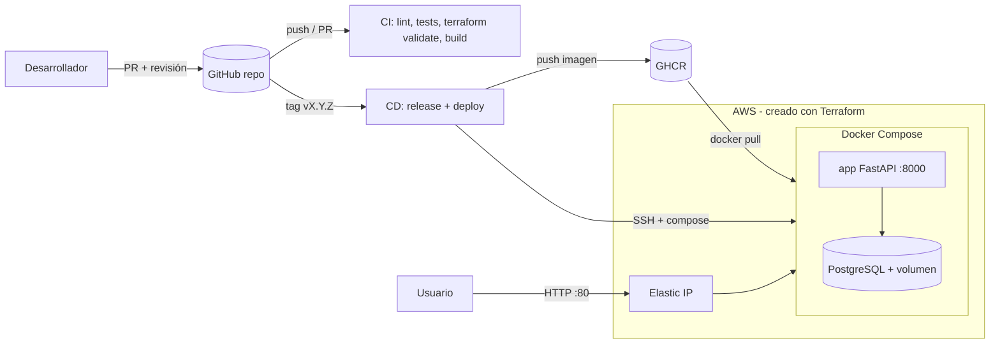

# Arquitectura propuesta

Recursos de AWS declarados en `infra/terraform`: VPC, subred pública, Internet Gateway, tabla de rutas,
Security Group (80 abierto; 22 solo con clave; 5432 cerrado), Key Pair, instancia EC2 (disco cifrado, IMDSv2),
Elastic IP.
